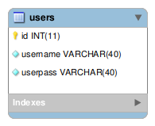

The Database is just a simple table, with simple columns, 
the model just check both arguments and returns all the data, 

## Model desing

There's no need if you want can setup a method in the [webappweb/models/Usersmodel.php](../webappweb/models/Usersmodel.php) 
that just use your own storage or way to autenticate the user data.

By default this project uses a embebed sqlite3 database, that you can 
change or move it, just by configure it on [webappweb/config/database.php](../webappweb/config/database.php).

## Compatibility

The DB is designed using mysqlworkbench but the generated sql file 
must have some tuneup to be compatible with all the others DB:

* remove any `COMMENTS ""`
* remove any `ENGINE=`
* remove any special comun data like `AUTOINCREMENT`

## Desing

The mysqlworkbench is pretty complete you can use it and generate 
the database SQL file later, so tuning with previous hints, 
will make it compatible, just use `; -- COMMENT`.

Then inside mysqlworkbench use comments to describe the dictionary.

